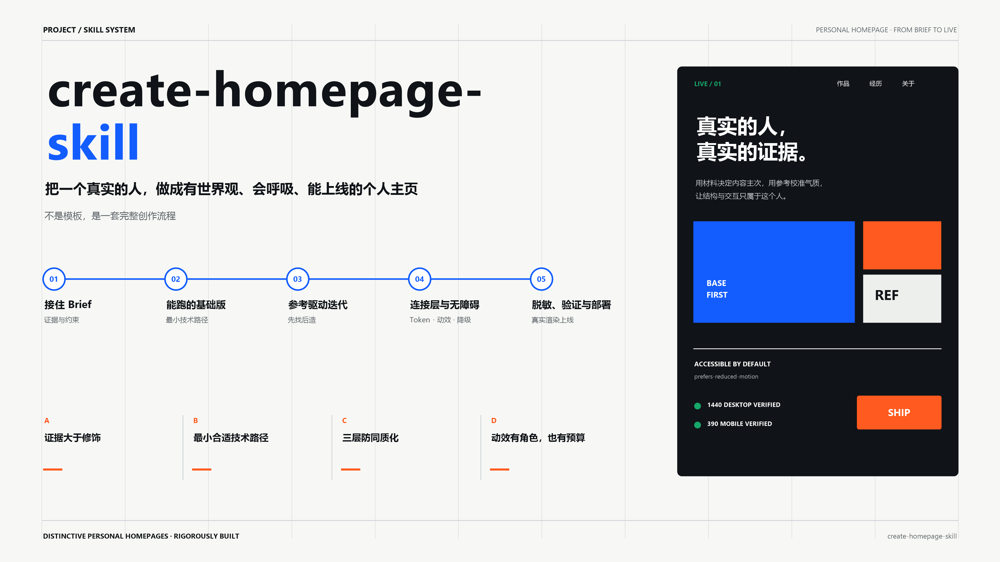

# create-homepage-skill

<p align="center">
  <a href="LICENSE"></a>
</p>



把**一个具体的人物**做成一个**有辨识度、可运行、可选择上线**的个人主页。

`create-homepage-skill` 是一套面向个人主页、作品集与简历网页的完整创作流程，也支持用户明确声明的虚构人物。它从 brief 和经确认的材料或人物设定出发：用户带了参考时先拆解参考，没有参考时先做低成本中性基础版，再通过反馈、证据或设定持续迭代。默认交付到本地可运行；用户要求部署准备后才补上线元数据和生产配置，只有获得明确授权后才操作公开仓库、托管平台或域名。

它不是一个换名字、换颜色就能复用的通用模板。

## 核心思路

- **Base-first**：先确认最小内容集并选择最小合适技术路径；已有参考时先分析参考，再完成协调、能运行的基础版。
- **证据大于修饰**：优先从公开资料、已脱敏摘录、用户总结或经确认的人物设定中提取成果、角色边界与内容主次。
- **参考先找后造**：先拆解用户认可的参考，再决定是否需要隐喻或世界观。
- **连接层保证质量**：统一设计 token；实际启用动效时，再补动效角色、减动效降级与性能规则。
- **专属外壳保证独特**：版式、文案、视觉语言与签名表达从个人证据或经确认的设定中生长。
- **三层防同质化**：通过换人测试、去皮测试和职业刻板测试避免模板化。

## 工作流

1. 接住 brief，确认身份、最小内容集、材料披露权限、隐私分级、语言与技术约束。
2. 保留现有技术栈，或为新项目选择静态、轻交互、React 强交互路径。
3. 用户提供了参考时先拆解参考；否则直接做低成本中性基础版。完成后进行一次真实浏览器验证。
4. 基于参考、反馈、证据或经确认的设定收敛专属视觉方向。
5. 按需引入动效，并补齐减动效与性能保护。
6. 完成隐私复核、响应式与基础无障碍检查，交付本地可运行版本；用户要求部署准备后再补齐上线元数据，获明确授权后才执行外部部署操作。

## 适用场景

- 从零创建个人主页或作品集
- 重设计已有个人网站，同时保留原技术栈
- 制作静态编辑型主页、滚动叙事或微交互作品集
- 将简历、项目材料、真实成果或经确认的人物设定转化为有说服力的网站内容
- 在发布前完成基础无障碍、动效可访问性、性能、隐私和跨端检查

## 项目结构

| 文件 | 内容 |
| --- | --- |
| `SKILL.md` | 核心原则、决策规则与完整执行流程 |
| `references/interview.md` | brief 复述清单与结构化 grilling 问题树 |
| `references/inspiration.md` | 参考拆解、隐喻判断与本地 skill 复用方法 |
| `references/motion-kit.md` | 设计 token、动效原语、预算与减动效契约 |
| `references/asset-checklist.md` | 证据/设定、图片、账号与隐私检查清单 |
| `references/build-verify-deploy.md` | 技术路径、浏览器验证、上线准备与部署流程 |
| `evals/scenarios.md` | 触发与回归自测场景 |

## 使用方式

将仓库作为 `create-homepage-skill` 加载到支持 `SKILL.md` 的 Agent 环境，然后直接描述你的身份、主页目标、已有材料和参考。

Windows Codex 环境可通过 Junction 加载：

```powershell
New-Item -ItemType Junction `
  -Path "$env:USERPROFILE\.codex\skills\create-homepage-skill" `
  -Target "<create-homepage-skill 仓库路径>"
```

示例请求：

```text
用 create-homepage-skill 帮我重做个人作品集。保留现有技术栈，
先根据我的简历和项目材料做一个能运行的基础版，再逐步确定视觉方向。
```
